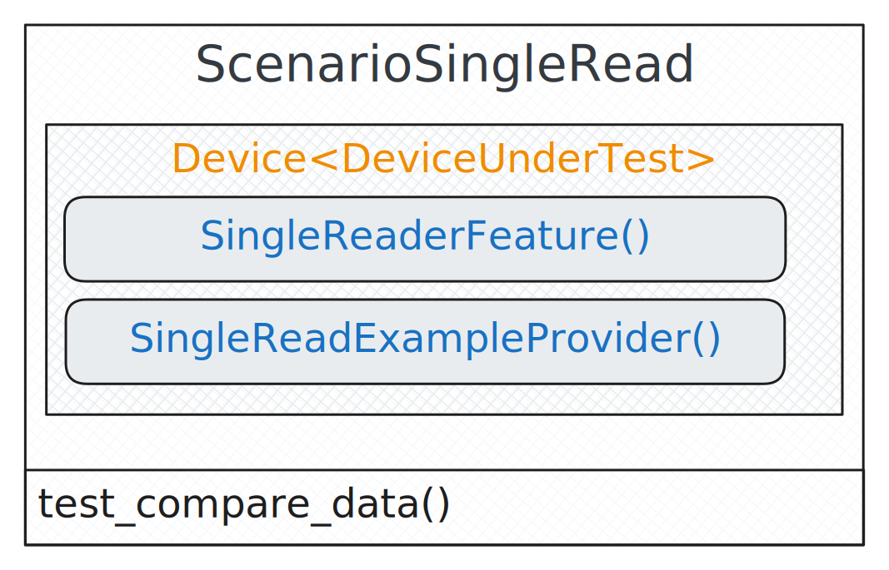
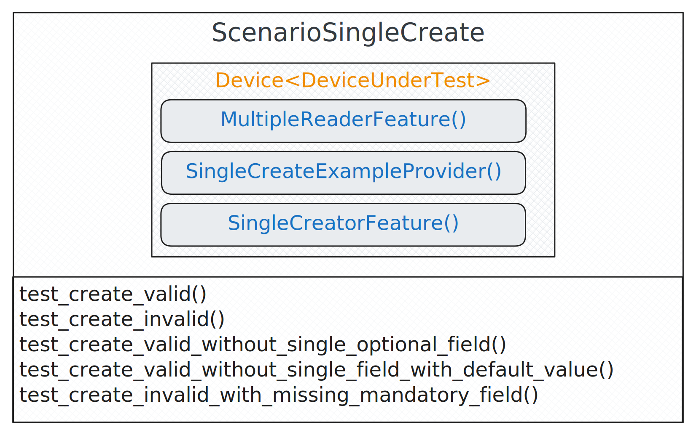
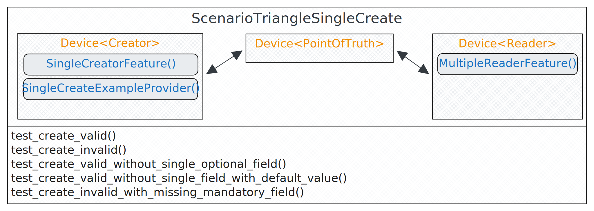
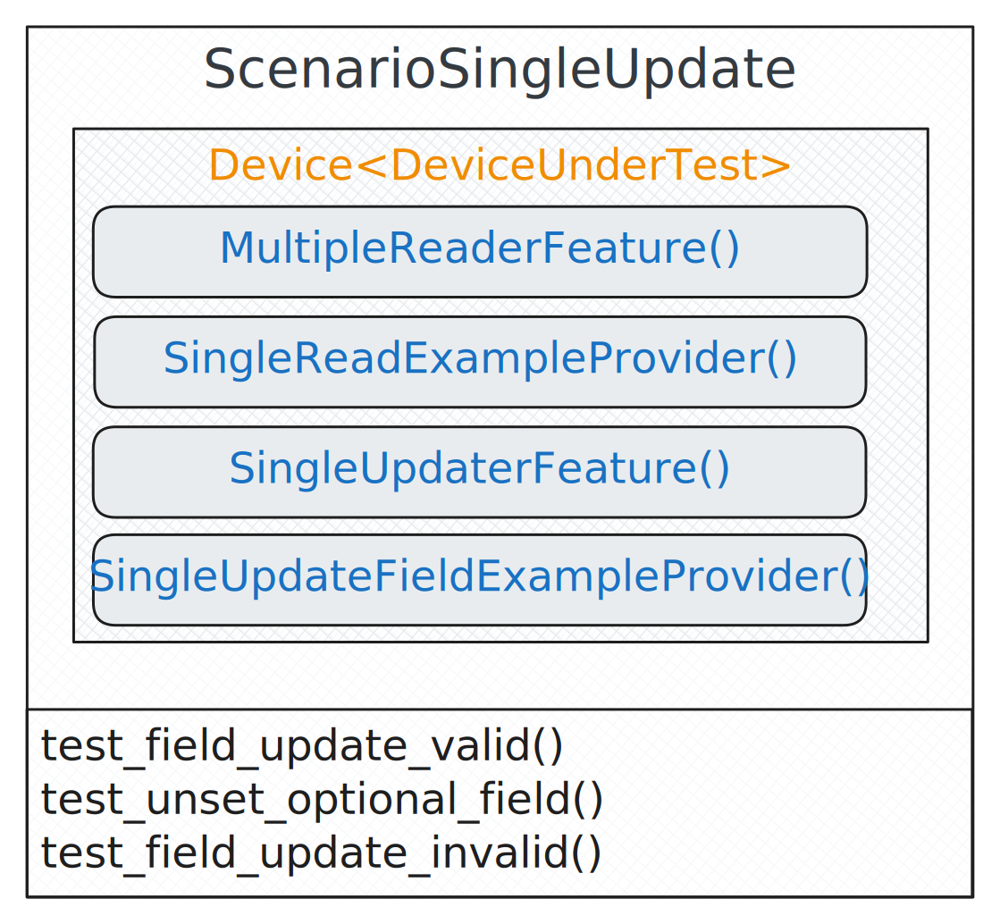
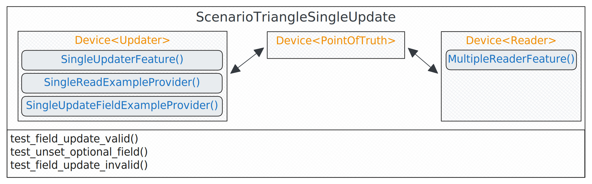
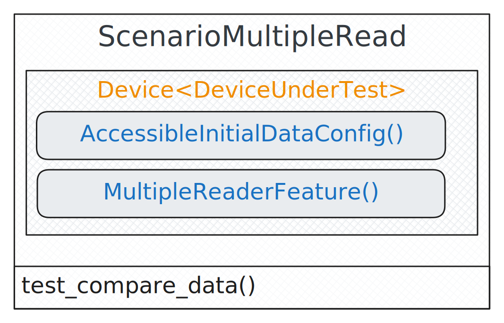

Scenarios
*********

Scenarios describe **what you need**. They define the tests and the necessary devices for them. Here you can find all
scenarios that are implemented in this BalderHub package.

Every CREATE/UPDATE/DELETE scenario exists in two variants: a NORMAL version and a TRIANGLE version.

In the **NORMAL** version, a single device handles both the creation, updating and deletion of the data as well as
reading the data back.

The **TRIANGLE** version differs in that it involves three devices. One device is responsible for creating, updating
or deleting the data, while a second device reads the data bag. Both devices are connected to the device or system
under test.

SINGLE Read Scenario
====================

.. autoclass:: balderhub.crud.scenarios.ScenarioSingleRead
    :members:

SINGLE Create Scenario
======================

Normal SINGLE Create Scenario
-----------------------------

.. autoclass:: balderhub.crud.scenarios.ScenarioSingleCreate
    :members:

Triangle SINGLE Create Scenario
-------------------------------

.. autoclass:: balderhub.crud.scenarios.ScenarioTriangleSingleCreate
    :members:

SINGLE Update Scenario
======================

Normal SINGLE Update Scenario
-----------------------------

.. autoclass:: balderhub.crud.scenarios.ScenarioSingleUpdate
    :members:

Triangle SINGLE Update Scenario
-------------------------------

.. autoclass:: balderhub.crud.scenarios.ScenarioTriangleSingleUpdate
    :members:

SINGLE Delete Scenario
======================

.. note::
    The DELETION scenarios are not fully developed.

MULTIPLE Read Scenario
======================

.. autoclass:: balderhub.crud.scenarios.ScenarioMultipleRead
    :members:

MULTIPLE Create Scenario
========================

.. note::
    The MULTIPLE CREATE scenarios are not fully developed.

MULTIPLE Update Scenario
========================

.. note::
    The MULTIPLE UPDATE scenarios are not fully developed.

MULTIPLE Delete Scenario
========================

.. note::
    The DELETION scenarios are not fully developed.
